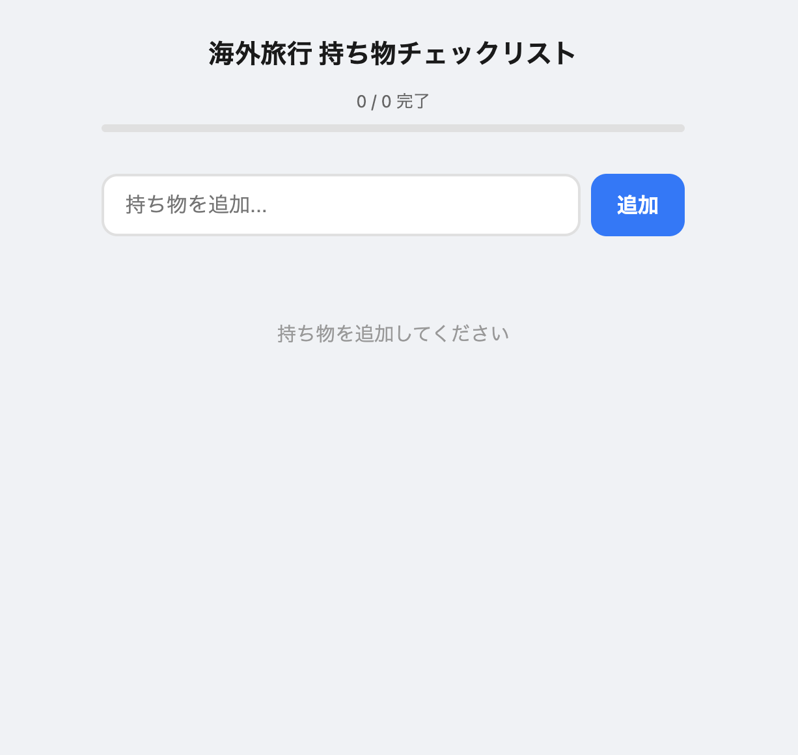
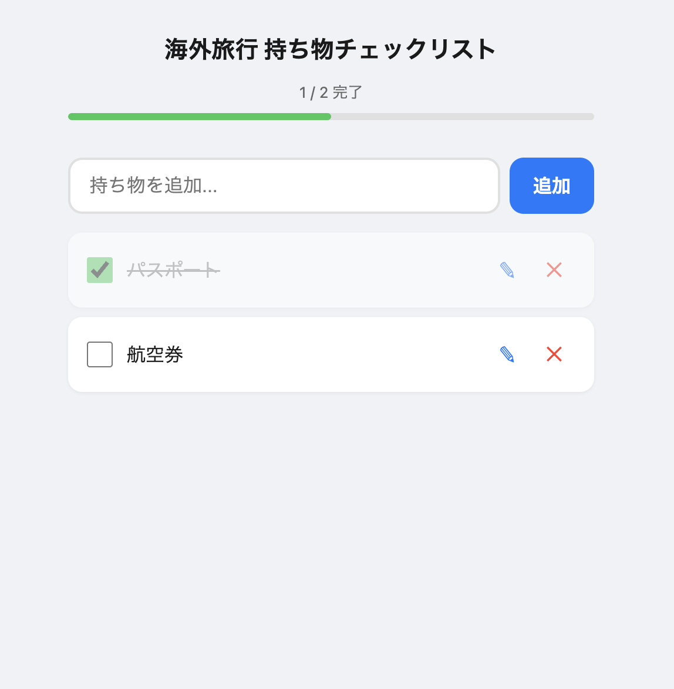

[English](../README.md)

# 海外旅行 持ち物チェックリスト

海外旅行の持ち物を管理するためのシンプルなチェックリストWebアプリです。

## アプリケーション

https://rkoba0718.github.io/ot-check-list/


アイテムの追加 → チェック → 編集 → チェックまでの一連の操作を確認できます。

| トップ画面 | 使用中 |
|:---:|:---:|
|  |  |

## 機能

- **アイテム追加** - テキスト入力で持ち物を追加
- **チェック管理** - チェックボックスで準備済み/未準備を切り替え
- **インライン編集** - 鉛筆アイコンからアイテム名をその場で編集
- **削除** - ×アイコンでアイテムを削除
- **進捗表示** - 完了数/全体数とプログレスバーで準備状況を可視化
- **データ永続化** - localStorage によりブラウザを閉じてもデータが保持される

## 使い方

1. [チェックリストアプリ](https://rkoba0718.github.io/ot-check-list/)にアクセス（PC・スマートフォン対応）
2. 入力欄に持ち物名を入力し「追加」ボタンを押す
3. 準備できたものはチェックボックスをタップして完了にする
4. 編集したい場合は鉛筆アイコン、削除したい場合は×アイコンを押す

## 技術スタック


| 項目 | 技術 |
|------|------|
| フロントエンド | HTML / CSS / Vanilla JavaScript |
| データ保存 | localStorage (ブラウザ内保存) |
| ホスティング | GitHub Pages |
| CI/CD | GitHub Actions |

## プロジェクト構成

```
ot-check-list/
├── index.html                 # アプリ本体（HTML/CSS/JS 一体型）
├── image/
│   ├── intro.mp4              # デモ動画
│   ├── top.png                # トップ画面スクリーンショット
│   └── usage.png              # 使用中スクリーンショット
├── .github/workflows/
│   └── deploy.yml             # GitHub Pages デプロイ用ワークフロー
└── README.md
```

## ローカルでの実行

```bash
# リポジトリをクローン
git clone https://github.com/rkoba0718/ot-check-list.git
cd ot-check-list

# ローカルサーバーを起動
python3 -m http.server 8080

# ブラウザで http://localhost:8080 にアクセス
```

## 注意事項

- データは各デバイスのブラウザ内（localStorage）に保存されるため、デバイス間でのデータ共有はできません
- ブラウザのデータを消去するとチェックリストもリセットされます
